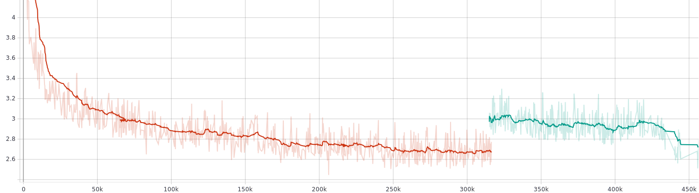
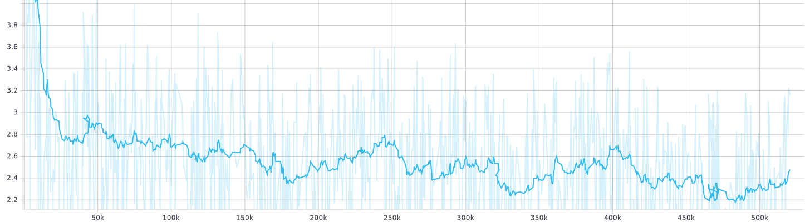

# ELMo-Text-Summarization
This is the code for the paper "Enhancing a Text Summarization System with ELMo" where we apply ELMo embeddings to pointer-generator networks for text summarization.

Example of generated summaries can be found:  [here](https://github.com/Rhuax/Enhancing-a-Text-Summarization-System-with-ELMo)

It has been trained on CNN/Daily Mail dataset:

 

It has been trained on Newsroom dataset:

